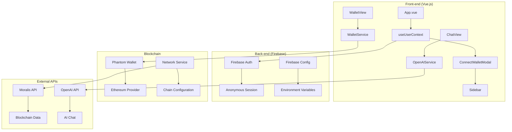

# Fluxo de Autenticação com Firebase e Login Anônimo

## Visão Geral

Este sistema utiliza **Firebase Authentication** com **login anônimo** para gerenciar sessões de usuários, onde a **carteira blockchain (Phantom)** serve como identificador único do usuário.

## Arquitetura do Sistema



## Papel da Carteira do Usuário

### 1. **Identificação Única**

- A carteira Phantom serve como **identificador único** do usuário
- O endereço da carteira é armazenado no campo `displayName` do perfil Firebase
- Permite rastrear usuários mesmo com login anônimo

### 2. **Autenticação Sem Senha**

- **Não requer email/senha** tradicional
- Usuário conecta carteira → Firebase cria sessão anônima
- Endereço da carteira vira o "nome" do usuário

### 3. **Persistência de Sessão**

- Firebase mantém a sessão ativa entre recarregamentos
- `onAuthStateChanged` monitora mudanças de estado
- Sessão persiste até logout explícito

### 4. **Segurança e Privacidade**

- Usuário mantém controle total da carteira
- Firebase não tem acesso às chaves privadas
- Apenas o endereço público é armazenado

## Componentes do Sistema

### AuthService (`src/services/auth.ts`)

```typescript
// Login anônimo com endereço da carteira
static async loginWithPhantom(address: string, network: string) {
  const { user } = await signInAnonymously(auth)
  await updateProfile(user, { displayName: address })

  return { address, network, timestamp: Date.now() }
}
```

### useUserContext (`src/composables/useUserContext.ts`)

```typescript
// Gerencia estado global da autenticação
const setupAuthState = async () => {
  if (AuthService.isAuthenticated()) {
    const user = AuthService.getCurrentUser()
    walletAddress.value = user?.displayName || null
    isLoggedIn.value = true
  }
}
```

### WalletService (`src/services/wallet.ts`)

```typescript
// Executa transações usando a carteira conectada
static async sendTransaction(transactionData, activeNetwork) {
  const provider = window.phantom?.ethereum
  // ... lógica de transação
}
```

## Fluxo de Dados

1. **Inicialização**: App verifica conexão Firebase e restaura sessão
2. **Login**: Usuário conecta carteira → Firebase cria sessão anônima
3. **Persistência**: Firebase mantém sessão, app restaura contexto
4. **Transações**: Usuário pode executar transações usando carteira conectada
5. **Logout**: Firebase limpa sessão, app limpa estado local

## Vantagens desta Abordagem

✅ **Simplicidade**: Login com um clique (carteira)
✅ **Segurança**: Usuário controla chaves privadas
✅ **Persistência**: Sessão mantida entre sessões
✅ **Rastreabilidade**: Endereço único para cada usuário
✅ **Sem Senhas**: Elimina necessidade de gerenciar credenciais

## Considerações de Segurança

- **Endereço público**: Apenas o endereço da carteira é armazenado
- **Chaves privadas**: Nunca saem da carteira do usuário
- **Sessão anônima**: Firebase não coleta dados pessoais
- **Logout**: Limpa completamente o estado da sessão
